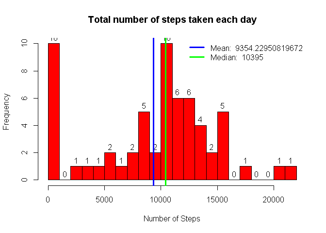

# Reproducible Research: Peer Assessment 1

## Loading and preprocessing the data

1. Initialize Variables.
2. Check "Download Directory Exists?", If not, create the same.
3. Download file into Download Directory and then unzip the same.
4. Create a data frame using the downloaded data file.


```r
# 
# Initialize Variables
#

library(httr)

zipdir       <- "./data"                                                              # Directory for Download
downloadfile <- "https://d396qusza40orc.cloudfront.net/repdata%2Fdata%2Factivity.zip" # File to be downloaded
zipfile      <- "./data/repdata_data_activity.zip"                                    # Local File Name  
datafile     <- "./data/activity.csv"                                                 # Unzipped File Name

# Check if Directory Exists? If not, create the same.
if (!file.exists(zipdir))  { dir.create(zipdir) }    

# Download the file and unzip the same.
if (!file.exists(zipfile)) {
  download.file(downloadfile, destfile=zipfile, cacheOK=TRUE, mode="wb", method="auto")
  if (file.exists(zipfile)) {
    #     filelist<-unzip(zipfile, overwrite=TRUE, list=TRUE, exdir=zipdir)
    unzip(zipfile, overwrite=TRUE, exdir=zipdir)
  }
} 

# Create dataframe from Downloaded Directory.
activitydata <- read.csv(datafile, 
                         colClasses=c("integer", "Date", "integer"), 
                         header=TRUE,
                         stringsAsFactors = FALSE)
```

Following the download and unzip, we will clean the data. Specifically, it will Convert the Date & Time fields.


```r
activitydata$date    <- as.POSIXct(strptime(activitydata$date, "%Y-%m-%d"),tz="")
activitydata$time    <- sprintf("%04d", activitydata$interval)                 
activitydata$time    <- as.POSIXct(activitydata$time, "%H%M",tz="")
```

## What is mean total number of steps taken per day?

```r
#
# 1. Make a histogram of the total number of steps taken each day
# 
# First get Total steps walked on a day.
# Then get the average of Steps for entire data.
#
steps_by_date <- aggregate(list(total_steps = activitydata$steps),
                           by=list(date = activitydata$date),
                           FUN=sum,
                           na.rm=TRUE)

steps_by_date_mean   <- mean(steps_by_date$total_steps)
steps_by_date_median <- median(steps_by_date$total_steps)
 
#
# Total Steps taken each Day
#
total_steps_by_date <- aggregate(list(total_steps = steps_by_date$total_steps),
                                 by=list(date = steps_by_date$date),
                                 FUN=sum,
                                 na.rm=TRUE)
```

The Histogram for the Total number of steps, and also mean and Median looks as follows:

```r
hist(total_steps_by_date$total_steps, 
     breaks = 20, 
     col = "red", 
     plot=TRUE,
     labels=TRUE,
     xlab = "Number of Steps", 
     main= "Total number of steps taken each day")

# Show Mean & Median
abline(v=steps_by_date_mean, col="blue", lwd=3)
abline(v=steps_by_date_median, col="green", lwd=3)

# Show Legend for Mean & Median
legend(x="topright", 
       legend=c(paste("Mean: ",steps_by_date_mean),
                paste("Median: ",steps_by_date_median)), 
       col=c("blue","green"), bty="n", lwd=3)
```

\

```r
# dev.copy(png, file="plot1.png", width=480, height=480)

paste("The Mean steps taken every day is : ", steps_by_date_mean)
```

```
## [1] "The Mean steps taken every day is :  9354.22950819672"
```

```r
paste("The Mean steps taken every day is : ", steps_by_date_median )
```

```
## [1] "The Mean steps taken every day is :  10395"
```


## What is the average daily activity pattern?

The time series plot (i.e. type = "l") of the 5-minute interval (x-axis) and the average number of steps taken, averaged across all days (y-axis) follows :


```r
avg_steps_by_timeint <- aggregate(list(avg_steps = activitydata$steps),
                                  by=list(interval = activitydata$interval),
                                  FUN=mean,
                                  na.rm=TRUE)

avgsteps =avg_steps_by_timeint[which.max(avg_steps_by_timeint$avg_steps),]$avg_steps
avgsteptm=avg_steps_by_timeint[which.max(avg_steps_by_timeint$avg_steps),]$interval

# dev.new()
plot(avg_steps ~ interval,
     data=avg_steps_by_timeint,
     xlab="Time interval",
     ylab="Mean steps",
     main="Mean Steps By Time Interval",
     type="l",
     col="blue",
     lwd=2)
abline(v=avgsteptm, col="red", lwd=3)
legend(x="topright", 
       legend=c(paste("Max Steps : ", avgsteps , " @ ", avgsteptm)),
       col=c("blue"), bty="n", lwd=3)
```

\

```r
# dev.copy(png, file="plot2.png", width=480, height=480)
```


```
## [1] "The 5-minute interval, on average across all the days in the dataset, contains the maximum number of steps? is at :  835"
```

## Imputing missing values

#### Objective: 
Calculate and report the total number of missing values in the dataset (i.e. the total number of rows with NAs)


```r
paste("Total # rows with missing Values is ", sum(is.na(activitydata$steps)))   # No of NA Rows
```

```
## [1] "Total # rows with missing Values is  2304"
```

#### Objective: 
Devise a strategy for filling in all of the missing values in the dataset. The strategy does not need to be sophisticated. For example, you could use the mean/median for that day, or 

> I am using the strategy to fill in missing values using the the mean for that 5-minute interval, etc.

#### Objective: 
- Create a new dataset that is equal to the original dataset but with the missing data filled in.
- Make a histogram of the total number of steps taken each day and Calculate and report the mean and median total number of steps taken per day. Do these values differ from the estimates from the first part of the assignment? What is the impact of imputing missing data on the estimates of the total daily number of steps?


```r
activity_imputed <- merge(activitydata,
                          avg_steps_by_timeint,
                          by_x="interval")

# correct the NA steps with average steps facor the interval
activity_imputed <- within(activity_imputed,
                           steps <- ifelse(is.na(activity_imputed$steps),
                                           activity_imputed$avg_steps,
                                           activity_imputed$steps))
ampsteps_by_date <- aggregate(list(total_steps = activity_imputed$steps),
                           by=list(date = activity_imputed$date),
                           FUN=sum,
                           na.rm=TRUE)

ampsteps_by_date_mean   <- mean(ampsteps_by_date$total_steps)
ampsteps_by_date_median <- median(ampsteps_by_date$total_steps)

# 
# Plot Histogram
#
hist(ampsteps_by_date$total_steps, 
     breaks=25,
     xlab="Steps/Day", 
     labels=TRUE,
     main="Histogram of total steps per day")
abline(v=ampsteps_by_date_mean, col="blue", lwd=3)
legend(x="topright", 
       legend=c(paste("Mean   (Amp): ",ampsteps_by_date_mean),
                paste("Median (Amp): ",ampsteps_by_date_median)), 
       col=c("blue","red"), bty="n", lwd=3)
```

\

```r
# dev.copy(png, file="plot3.png", width=480, height=480)
```


## Are there differences in activity patterns between weekdays and weekends?

#### Objective: 
- Use the dataset with the filled-in missing values for this part.
- Create a new factor variable in the dataset with two levels - "weekday" and "weekend" indicating whether a given date is a weekday or weekend day.
- Make a panel plot containing a time series plot (i.e. type = "l") of the 5-minute interval (x-axis) and the average number of steps taken, averaged across all weekday days or weekend days (y-axis). See the README file in the GitHub repository to see an example of what this plot should look like using simulated data.


```r
library(plyr)
```

```
## Warning: package 'plyr' was built under R version 3.2.3
```

```r
library(lattice)

# Creating New Dataset activity_imputed with a factoring (column) for weekday and weekend.
activity_imputed$Weekend <- weekdays(activity_imputed$date) == "Saturday" | 
                            weekdays(activity_imputed$date) == "Sunday"

activity_imputed$Weekend <- factor(activity_imputed$Weekend, 
                                   levels = c(F, T), 
                                   labels = c("Weekday", "Weekend"))

activity_imputed <- ddply(activity_imputed, 
                          .(interval, Weekend), 
                          summarize, 
                          steps = mean(steps, na.rm = T))

xyplot(steps ~ interval | Weekend, activity_imputed, 
       type = "l", 
       layout = c(1, 2), 
       ylab = "Number of Steps", 
       xlab = "Interval", 
       main = "Time Series for Weekend and Weekday Activity Patterns")
```

\


